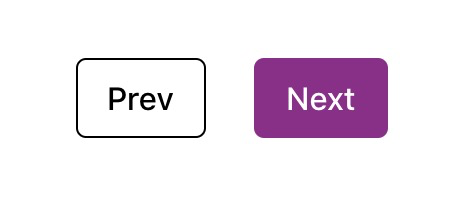

# Options

## dateFormat

- Type: `string`
- Default: `'ddd MMM DD YYYY'`

The [date](./front-matter.md#date) will be displayed in the layout with this format.
You can find all available formats [here](https://github.com/iamkun/dayjs/blob/dev/docs/en/API-reference.md#displaying)

e.g.

```js
module.exports = {
  themeConfig: {
    dateFormat: 'YYYY-MM-DD'
  }
}
```

## nav

- Type: `Array<{ text: string, link: string }>`
- Default: `See below`

Links you wish to be displayed at navbar.

Here's the default:

```js
module.exports = {
  themeConfig: {
    nav: [
      {
        text: 'Blog',
        link: '/',
      },
      {
        text: 'Tags',
        link: '/tag/',
      },
    ]
  },
}
```

## footer

### footer.contact


- Type: `Array<{ type: ContactType, link: string }>`
- Default: `undefined`

Contact information, displayed on the left side of footer.

e.g.
```js
module.exports = {
  themeConfig: {
    footer: {
      contact: [
        {
          type: 'github',
          link: 'https://github.com/vuejs/vuepress',
        },
        {
          type: 'twitter',
          link: 'https://github.com/vuejs/vuepress',
        },
      ],
    },
  },
}
```

For now `ContactType` supports following enums:

- codepen
- codesandbox
- facebook
- github
- gitlab
- instagram
- linkedin
- mail
- messenger
- music
- phone
- twitter
- video
- web
- youtube

::: tip
Welcome contribution of adding more built-in contact type.
:::

### footer.copyright

Copyright information, displayed on the right side of footer.

e.g.
```js
module.exports = {
  themeConfig: {
    footer: {
      copyright: [
        {
          text: 'Privacy Policy',
          link: 'https://policies.google.com/privacy?hl=en-US',
        },
        {
          text: 'MIT Licensed | Copyright © 2018-present Vue.js',
          link: '',
        },
      ],
    },
  },
}
```

## directories

- Type: `DirectoryClassifier[]`
- Default: `See below`

```JavaScript
[
  {
    id: 'post',
    dirname: '_posts',
    path: '/',
  },
]
```

By default, pages are placed in `_post`, and the path for post list is `/`. Here's an example if you wish to customize it:

```JavaScript
[
  {
    id: 'writing', // Unique id for current classifier
    dirname: '_writings', // Matched directory name
    path: '/writings/', // Entry page for current classifier
    title: '隨筆', // Entry and pagination page titles for current classifier.
    layout: 'IndexWriting', // Layout component name for entry page.
    frontmatter:{ //Front matter for entry page.
      tag: 'vuepress'
    },
    itemLayout: 'Writing', // Layout for matched pages.
    itemPermalink: '/writings/:year/:month/:day/:slug', // Permalink for matched pages.
    pagination: { // Pagination behavior
      lengthPerPage: 2,
    },
  }
]
```

Reference:
- [document classifiers](https://vuepress-plugin-blog.ulivz.com/guide/getting-started.html#document-classifier)

## frontmatters

- Type: `FrontmatterClassifier[]`
- Default: `See below`

```JavaScript
[
  {
    id: 'tag',
    keys: ['tag', 'tags'],
    path: '/tag/',
  },
]
```

Only `tag` and `tags` in front matter will be classified, and the path for it is `'/tag/'` by default. Let's see how to customize it:

```JavaScript
[
  {
    id: 'location', // Unique id for current classifier
    keys: ['location'], // Frontmatter keys used to classify pages
    path: '/location/', // Entry page for current classifier
    title: '地點', // Entry, scope and pagination page titles for current classifier.
    layout: 'IndexLocation', // Layout component name for entry page.
    scopeLayout: 'ScopeLocation', // Layout component name for scope page.
    frontmatter: { //Front matter for entry page.
      description: 'Hello'
    }, 
    pagination: { // Pagination behavior
      lengthPerPage: 2,
    }, 
  },
]
```
Reference:
- [Frontmatter Classifier](https://vuepress-plugin-blog.ulivz.com/guide/getting-started.html#frontmatter-classifier)
## globalPagination

- Type: `object`
- Default: `{ lengthPerPage: 5 }`

Pagination config for all directories and frontmatters. For example:

```JavaScript
{
  prevText:'上一頁', // Text for previous links.
  nextText:'下一頁', // Text for next links.
  lengthPerPage:'2', // Maximum number of posts per page.
  layout:'Pagination', // Layout for pagination page
}
```

For more information, please visit [Pagination Config](https://vuepress-plugin-blog.ulivz.com/pagination/#sorter).
## sitemap

- Type: `object`
- Default: `undefined`

You can simply enable it by filling out `hostname` property with your host name:

```JavaScript
{
  hostname: 'https://yourdomain'
}
```

Please head [vuepress-plugin-sitemap](https://github.com/ekoeryanto/vuepress-plugin-sitemap#options) for more details.

## comment

- Type: `object`
- Default: `undefined`

Vssue and Disqus are our built-in comment services. Here's the required properties to enable:

```JavaScript
// Disqus
{
  service: "disqus",
  shortname: "Your blog's shortname",
}

// Vssue
{
  service: 'vssue',
  owner: 'You',
  repo: 'Your repo', 
  clientId: 'Your clientId',
  clientSecret: 'Your clientSecret',
}
```
Further configuration, please visit:
- [vuepress-plugin-disqus-comment](https://vuepress-plugin-disqus.netlify.com/#usage)
- [vuepress-plugin-vssue](https://vssue.js.org/guide/vuepress.html#usage)

## newsletter

- Type: `object`
- Default: `undefined`

Mailchimp is our default newsletter service. The only required property to enable newsletter is `endpoint`:

```JavaScript
{
  endpoint: 'https://billyyyyy3320.us4.list-manage.com/subscribe/post?u=4905113ee00d8210c2004e038&amp;id=bd18d40138'
}
```

Please head [vuepress-plugin-mailchimp](https://vuepress-plugin-mailchimp.billyyyyy3320.com/#config) to see how to get your `endpoint`.

## feed

- Type: `object`
- Default: `undefined`

RSS, Atom, and even JSON feeds are supported. The only required property to enable feed is `canonical_base`:

```JavaScript
{
  canonical_base:'http://yoursite',
},
```
RSS is the default type of feed.

All the options in [vuepress-plugin-feed](https://github.com/webmasterish/vuepress-plugin-feed#options) are available.
Moreover, we present an easier approach to enable/disable the feed types, for instance:

```JavaScript
{
  canonical_base:'http://yoursite',
  rss:false
  atom:true,
  json:false
}
```

## summary

- Type: `boolean`
- Default: `true`

Whether to automatically extract summary from source markdowns. You can write summary manually by [front matter](./front-matter.md#summary). Summary is not only for displaying but also page meta description. 


## summaryLength

- Type: `number`
- Default: `200`

Set the length of summary.


## pwa

- Type: `boolean`
- Default: `false`

Whether to enable PWA support. this option is powered by the [official
PWA plugin](https://v1.vuepress.vuejs.org/plugin/official/plugin-pwa.html).

if you enable this option, the default options of the internal PWA
plugin is as follows:

```js
{
  serviceWorker: true,
  updatePopup: true
}
```

## paginationComponent

- Type: `string`
- Default: `'Pagination'`

Custom the pagination component.

The default is the 
[pagination component](https://vuepress-plugin-blog.ulivz.com/components/#pagination) powerful by 
[@vuepress/plugin-blog](https://github.com/ulivz/vuepress-plugin-blog):


You can set this option to `SimplePagination` to enable another out-of-box 
[simple pagination component](https://vuepress-plugin-blog.ulivz.com/components/#simplepagination):



You can also wirte a custom pagination component and register it as a global component. then pass its
name to this option.

## smoothScroll

- Type: `boolean`
- Default: `false`

The `themeConfig.smoothScroll` option allows you to enable smooth scrolling.

```JavaScript
// .vuepress/config.js
module.exports = {
  themeConfig: {
    smoothScroll: true
  }
}
```
