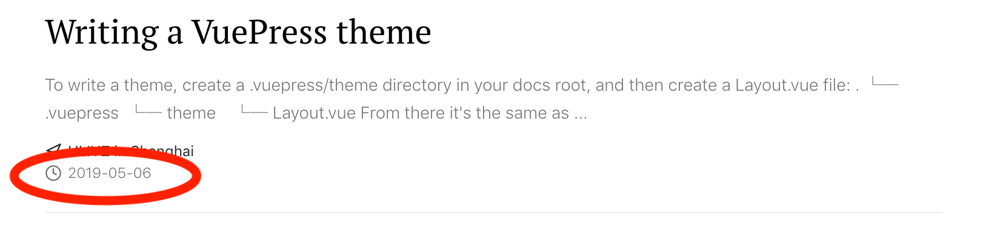
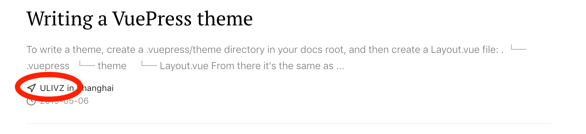
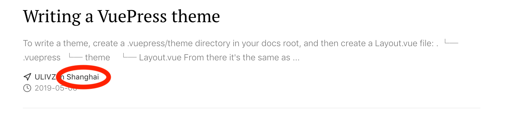
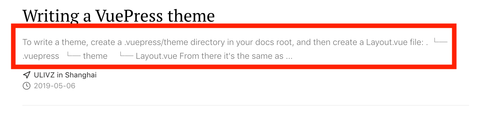

# Front Matter

## tag/tags

- Type: `string|string[]`
- Default: `undefined`

The key to classifier pages.

e.g.

```markdown
---
tags: 
  - JavaScript
  - DOM
---
```

## date
Date for the post. This will be used for permalink and displayed in the layout:



e.g.
```markdown
---
date: 2016-10-20
---
```

## author

Author for the post. This will be displayed in the layout:



e.g.

```markdown
---
author: ULIVZ
---
```

## location

Location for the post. This will be displayed in the layout:



e.g.

```markdown
---
location: Hangzhou
---
```

## summary

Summary for the post. This will be displayed in the layout:



e.g.

```markdown
---
summary: Here's a quick post on what I found.
---
```
